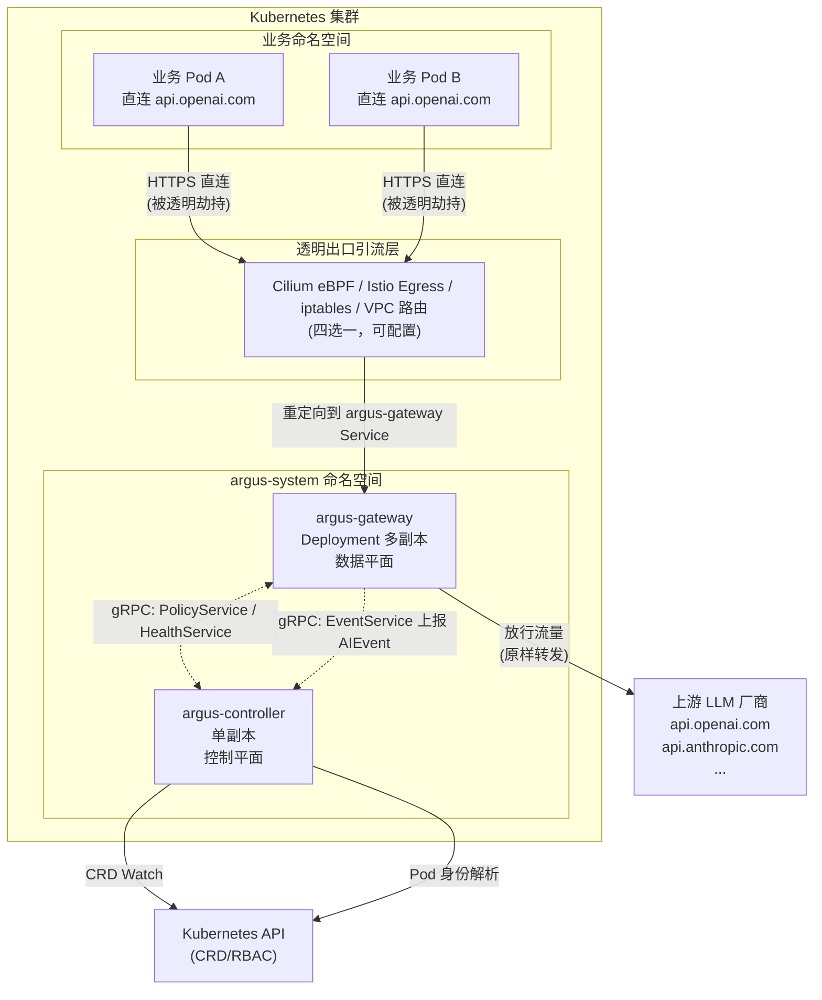
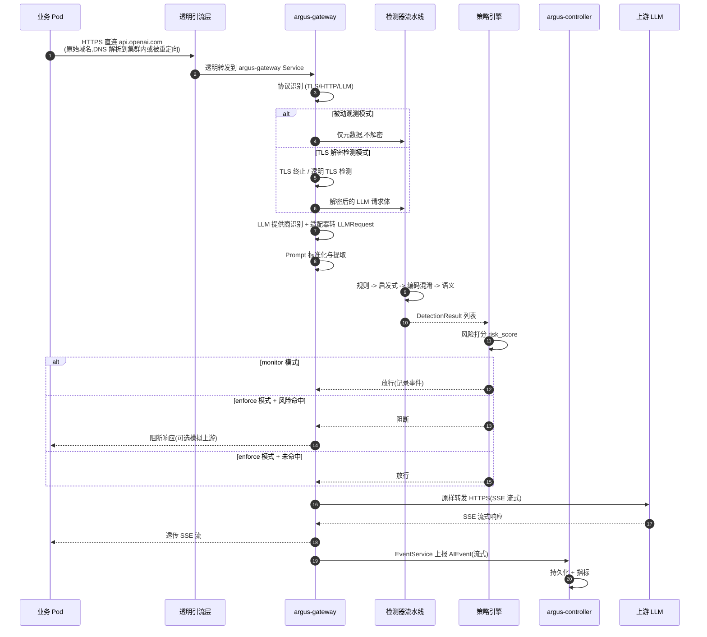
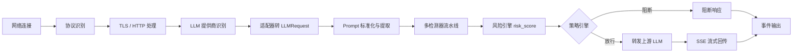
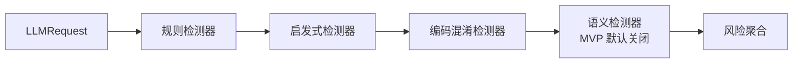

# Argus（观枢）— Kubernetes 原生 AI 大模型安全检测系统 Spec

> 产品标语：**Argus(观枢) — Kubernetes 原生大模型出口安全网关**
> 项目简写：仓库 `argus` / Helm Chart `argus` / 二进制 `argus-gateway`、`argus-controller` / 中文产品名 **观枢**
> Spec 范围：MVP 阶段一设计与交付物定义；评审通过后再进入代码脚手架阶段。

---

## 1. Why

企业将 LLM 能力引入业务 Pod 后，业务侧会直接以 HTTPS 形式请求 OpenAI、Azure OpenAI、Anthropic、通义、智谱等大模型厂商域名。这条出口流量天然绕过了应用层 WAF 与 API 网关，存在三类不可控风险：

1. **Prompt Injection（提示注入）**：OWASP AITG-APP-01 列为 LLM Top 10 首要风险，可被用于指令覆盖、系统提示词窃取、上下文篡改、间接注入。
2. **数据外泄**：业务 Pod 内可能将敏感上下文随 Prompt 一并发往外部 LLM。
3. **审计盲区**：集群内 LLM 出站流量无统一身份溯源、无事件留存、无阻断能力。

现有方案或要求业务改造 SDK 与 `OPENAI_BASE_URL`（侵入式），或采用 Sidecar / DaemonSet（架构成本高、违背零改造约束）。**Argus 通过集群级单一逻辑安全网关 + 全局透明出口引流**，在不改动业务 Pod 的前提下，对 LLM 出站流量做协议识别、Prompt 提取、多检测器流水线、风险打分与放行/阻断决策，并产出标准化 `AIEvent`。

---

## 2. 不可违背的硬性架构约束

| 编号 | 约束 | 说明 |
| --- | --- | --- |
| C1 | 单集群单逻辑网关 | 每个K8s集群部署**单个逻辑集群级别的观枢安全网关**（Deployment 多副本逻辑统一）。 |
| C2 | 禁止 Sidecar / DaemonSet | 禁止 Pod 侧车模式、禁止每容器 Agent、禁止节点级 DaemonSet 传感器。 |
| C3 | 业务零改造 | 不改业务源码 / Dockerfile / LLM SDK，不要求配置 `OPENAI_BASE_URL` 等环境变量。客户执行 `helm install argus` 完成安装。 |
| C4 | 全局透明出口引流 | 流量靠集群全局透明出口网络能力引流，**不依赖业务侧配置代理**。K8s Service 自身无法捕获任意出站 HTTPS，必须依赖 Cilium/eBPF、Istio Egress Gateway、iptables/nftables、VPC 路由之一。若方案存在透明劫持局限，需显式写明，**严禁退回 Sidecar 架构**。 |
| C5 | 原始域名直达 | Pod 仍直接请求 LLM 厂商原始域名，业务感知不到网关存在。 |

> 上述 5 条为不可妥协基线，任何后续设计、迭代、降级方案均不得违反。

---

## 3. 逻辑架构

### 3.1 逻辑拓扑



### 3.2 完整报文请求流转路径



---

## 4. 组件职责矩阵

| 能力 / 职责 | argus-gateway | argus-controller | 备注 |
| --- | :---: | :---: | --- |
| 接收被劫持的出口流量 | 是 | 否 | 仅数据平面 |
| TLS 终止 / 透明 TLS 检测 | 是 | 否 | 见 §10 |
| LLM 协议识别与适配器 | 是 | 否 | OpenAI 兼容优先 |
| Prompt 提取与标准化 | 是 | 否 |  |
| 多检测器流水线 | 是 | 否 | MVP 用 Go，留接口供 C++ 替换 |
| 风险打分与策略决策 | 是 | 否 |  |
| SSE 流式代理 + 背压 | 是 | 否 | 有界内存 |
| 上报 AIEvent | 是（生产者） | 是（消费者） | EventService 流式 |
| CRD 管理（ArgusSecurityPolicy / LLMProvider） | 否 | 是 |  |
| 策略 / Provider 配置下发 | 否 | 是 | PolicyService |
| Pod 身份解析（RBAC） | 否 | 是 | 见 §9 |
| 健康状态采集 | 是（上报） | 是（聚合） | HealthService |
| 持久化安全事件 | 否 | 是 | MVP 阶段先用本地存储 |
| Prometheus 指标暴露 | 是 | 是 |  |
| 繁重检测业务逻辑 | 否 | 否 | 控制平面严禁运行检测 |

---

## 5. 数据平面 argus-gateway

### 5.1 部署形态

- `Deployment` 多副本水平扩展，前端挂载 `Service`（ClusterIP），可选 NodePort/LoadBalancer 用于指标暴露。
- 通过 HPA 按 CPU / 自定义指标扩缩容，避免单点 CPU 瓶颈。
- Pod 资源 `requests`/`limits` 必须显式声明，配合 §5.4 有界内存约束。

### 5.2 内部处理流水线



各阶段职责：

| 阶段 | 职责 | 关键点 |
| --- | --- | --- |
| 网络连接 | 接收透明引流流量 | 区分 LLM 流量 vs 非 LLM 流量；非 LLM 流量透传或按策略丢弃 |
| 协议识别 | 判定 TLS / HTTP/1.1 / HTTP/2 | 仅对识别出的 LLM 流量做深度检测（C5 + 性能约束） |
| TLS / HTTP 处理 | 被动观测 or TLS 解密 | 见 §10 |
| LLM 提供商识别 | 按 SNI / Host / Path 命中 LLMProvider | OpenAI 兼容接口优先 |
| 适配器 | 转内部统一 `LLMRequest` | 多厂商差异屏蔽 |
| Prompt 标准化 | 提取 `messages` / `system` / `tools` | 处理多轮、多模态文本部分 |
| 多检测器流水线 | 规则 -> 启发式 -> 编码混淆 -> 语义 | 见 §11 |
| 风险引擎 | 输出 `risk_score` ∈ [0,1] | 加权聚合 |
| 策略引擎 | monitor 放行 / enforce 放行或阻断 | 见 §11 + §12 |
| SSE 流式代理 | 透传上游 SSE，按 token 流式回写 | 禁止完整缓存报文 |
| 事件输出 | 产出 `AIEvent` 上报 controller | 见 §13 |

### 5.3 SSE 流式与背压

- 上游响应以 `Transfer-Encoding: chunked` 或 SSE `text/event-stream` 形式回流时，网关按 chunk 透传给业务 Pod，**禁止在内存中聚合完整响应**。
- 上游 -> 网关 -> Pod 三段链路均启用背压：当 Pod 读取慢时，网关暂停从上游读取并释放缓冲；当上游推送过快时，对上游施加 TCP 层反压。
- 单连接缓冲上限可配置（默认 64KiB），超出后触发背压而非 OOM。
- 流式期间持续刷新检测器上下文，必要时对增量 token 做轻量检测（语义检测器仅在请求阶段执行，响应阶段不重复跑全量语义检测）。

### 5.4 有界内存与水平扩容

| 维度 | 约束 | 实现 |
| --- | --- | --- |
| 单连接内存 | 有界 | 流式缓冲上限 + 背压 |
| 单 Pod 连接数 | 有界 | `max_connections` 配置 + LRU 关闭 |
| Pod 水平扩容 | 支持 | HPA（CPU + 自定义指标 `argus_active_llm_connections`） |
| CPU 瓶颈规避 | 是 | 检测器流水线可在后续替换 C++ 实现（接口预留） |
| 非检测路径开销 | 最小 | 仅 LLM 流量进入深度检测流水线 |

### 5.5 Prometheus 指标

| 指标名 | 类型 | 说明 |
| --- | --- | --- |
| `argus_request_total{provider,model,action}` | Counter | 入站 LLM 请求计数，按 action=allow/block |
| `argus_request_duration_seconds` | Histogram | 端到端延迟 |
| `argus_detection_duration_seconds{detector}` | Histogram | 单检测器耗时 |
| `argus_detection_hits_total{detector,type}` | Counter | 检测器命中计数 |
| `argus_active_llm_connections` | Gauge | 当前活跃 LLM 连接 |
| `argus_blocked_total{policy}` | Counter | 阻断计数 |
| `argus_sse_streams_total` | Counter | SSE 流计数 |
| `argus_event_report_failures_total` | Counter | 事件上报失败计数 |
| `argus_gateway_health` | Gauge | 网关健康（1/0） |

---

## 6. 控制平面 argus-controller

- `Deployment` 单副本（leader election，预留 HA 切换），纯 Go。
- 直接 watch `ArgusSecurityPolicy`、`LLMProvider` CRD，缓存后通过 gRPC 下发到所有 gateway 副本。
- 通过 `EventService` 流式接收 `AIEvent`，MVP 阶段写入本地卷（PersistentVolume），后续接入对象存储 / 外部 SIEM。
- 通过 K8s RBAC 反查 Pod 身份（见 §9），不在网关侧执行带权限的 K8s 调用。
- **严禁在控制器中运行繁重检测业务逻辑**。

---

## 7. 内部 gRPC 服务契约

优先编写 protobuf 契约再写业务代码。以下为契约概要，正式 `.proto` 文件在脚手架阶段产出。

### 7.1 PolicyService（controller -> gateway 下发）

| 方法 | 语义 |
| --- | --- |
| `WatchPolicies(stream WatchRequest) returns (stream PolicySnapshot)` | gateway 发起 watch，controller 推送全量 + 增量策略快照 |
| `WatchProviders(stream WatchRequest) returns (stream ProviderSnapshot)` | 同上，推送 LLMProvider 配置 |

### 7.2 DetectionService（gateway 内部检测器抽象）

```protobuf
service DetectionService {
  rpc Detect(DetectRequest) returns (DetectResponse);
  rpc DetectStream(stream DetectRequest) returns (stream DetectResponse);
}

message DetectRequest {
  LLMRequest request = 1;
  DetectionContext context = 2;  // 多轮会话上下文
}
message DetectResponse {
  repeated DetectionResult results = 1;
  double risk_score = 2;
}
```

> 该服务既支持进程内 in-process gRPC（MVP Go 检测器），也支持后续替换为远程 C++ 检测器，对代理层透明。

### 7.3 EventService（gateway -> controller 上报）

| 方法 | 语义 |
| --- | --- |
| `ReportEvents(stream AIEvent) returns (ReportAck)` | gateway 流式上报，controller 批量 ack |

### 7.4 HealthService（双向健康检查）

| 方法 | 语义 |
| --- | --- |
| `GatewayHeartbeat(stream Heartbeat) returns (HeartbeatAck)` | gateway -> controller 心跳 |
| `ControllerHealth(Empty) returns (HealthStatus)` | gateway 探测 controller 健康 |

---

## 8. CRD 定义

### 8.1 ArgusSecurityPolicy

```yaml
apiVersion: argus.argus.io/v1alpha1
kind: ArgusSecurityPolicy
metadata:
  name: default-prompt-injection
  namespace: argus-system
spec:
  mode: enforce              # monitor | enforce
  failureMode: fail-open     # fail-open | fail-closed
  providers:
    - name: openai
    - name: azure-openai
  detectors:
    rules:
      enabled: true
      rules: []
    heuristic:
      enabled: true
    encoding:
      enabled: true
    semantic:
      enabled: false          # MVP 阶段默认关闭,依赖外部模型
  thresholds:
    blockScore: 0.8
    logScore: 0.3
  scope:
    namespaces: ["*"]         # 作用域
    workloads: []
```

### 8.2 LLMProvider

```yaml
apiVersion: argus.argus.io/v1alpha1
kind: LLMProvider
metadata:
  name: openai
  namespace: argus-system
spec:
  type: openai-compatible
  hosts:
    - api.openai.com
    - *.openai.com
  sni:
    - api.openai.com
  upstream:
    scheme: https
    # 原样转发,不修改 Host
  adapter: openai
  models:
    - gpt-4o
    - gpt-4o-mini
```

---

## 9. 流量引流方案对比

> **核心结论**：K8s Service 自身无法捕获任意出站 HTTPS。MVP 推荐方案为 **Cilium eBPF 透明重定向**（首选）或 **iptables/nftables TPROXY**（兜底）。Istio Egress Gateway 与 VPC 路由作为可选补充方案。**任一方案均不退回 Sidecar 架构。**

### 9.1 方案对比表

| 方案 | 透明劫持能力 | 业务改造 | 内核依赖 | 性能损耗 | 运维复杂度 | 主要硬性限制 |
| --- | :---: | :---: | --- | :---: | :---: | --- |
| **Cilium eBPF** | 强（按 Pod/域名/SNI 重定向） | 无 | 内核 ≥ 5.4，Cilium ≥ 1.11 | 低 | 中 | 需 Cilium 作为 CNI；老内核不支持；与某些云厂商 CNI 互斥 |
| **Istio Egress Gateway** | 中（依赖 ServiceEntry + Sidecar 注入或 ambient mode） | **ambient 模式下零改造；经典 sidecar 模式违背 C2** | 无 | 中 | 高 | 经典 Istio 必须 sidecar 注入，**违背 C2 不可选**；ambient 模式成熟度待评估 |
| **iptables / nftables TPROXY** | 中（按目的 IP/端口重定向，需配合 DNS 解析） | 无 | 通用 Linux | 中 | 中 | 无法基于 SNI 精准匹配，需 DNS 解析前置；多副本网关需 DNAT 分流 |
| **云厂商 VPC 路由** | 弱（按 CIDR 路由到网关 ENI） | 无 | 无 | 低 | 低 | 仅按 IP 路由，无法基于域名；LLM 厂商 IP 动态变化；跨可用区流量费用 |

### 9.2 各方案详细说明

#### 9.2.1 Cilium eBPF（MVP 首选）

- **原理**：通过 Cilium `CiliumNetworkPolicy` + `CiliumEgressGatewayPolicy`，或基于 eBPF `bpf_sk_assign` / `bpf_msg_redirect` 在 socket 层将匹配目的的连接重定向到 argus-gateway。
- **匹配维度**：Pod identity（Cilium identity）、目的 FQDN（Cilium DNS proxy / SNI）、目的 IP/CIDR、目的端口。
- **优势**：
  - 真正透明，Pod 无感知；不修改业务 DNS 与连接目标。
  - 性能损耗低，eBPF 在内核态完成重定向。
  - 与 Cilium NetworkPolicy 自然融合，便于落地 §10 流量拦截范围。
- **硬性限制**：
  - 集群必须以 Cilium 作为 CNI；与 Calico / 云厂商 ENI CNI 互斥。
  - 内核版本要求 ≥ 5.4（建议 ≥ 5.10）。
  - 托管 K8s（如 GKE Autopilot、EKS Fargate）可能不支持自定义 eBPF。
  - LLM 厂商若使用动态 IP，需依赖 FQDN 模式，要求 Cilium DNS proxy 启用。

#### 9.2.2 Istio Egress Gateway

- **原理**：通过 `ServiceEntry` 声明外部 LLM 域名，`VirtualService` 将匹配流量路由到 Egress Gateway。
- **不可选原因**：经典 Istio 数据平面依赖 Envoy Sidecar 注入，**直接违反 C2**。
- **可选条件**：Istio Ambient Mesh 模式（ztunnel + waypoint）可零 sidecar，但成熟度与生产稳定性需评估，MVP 不作为首选。

#### 9.2.3 iptables / nftables TPROXY（兜底）

- **原理**：在节点上通过 `iptables -t mangle TPROXY` 将目的为 LLM IP/端口的流量透明代理到本机 argus-gateway 监听端口。
- **优势**：通用、无 CNI 绑定、内核原生支持。
- **硬性限制**：
  - 无法基于 SNI 精准匹配，需要前置 DNS 解析（pod 内 DNS 查询返回 LLM IP 后才能命中规则）。
  - LLM 厂商 IP 频繁变化，需配套 IP 列表同步机制（轮询 DNS）。
  - 多副本 argus-gateway 时需要在节点间做 DNAT 分流（一般通过 BGP 或 keepalived VIP）。
  - 与 kube-proxy iptables 模式共存需小心链顺序。

#### 9.2.4 云厂商 VPC 路由

- **原理**：在 VPC 路由表将 LLM 厂商 CIDR 指向 argus-gateway 所在 ENI。
- **硬性限制**：
  - 仅按 CIDR 路由，无法基于域名。
  - LLM 厂商 IP 不固定且无官方 CIDR 列表，需自行维护。
  - 跨可用区流量产生费用。
  - 路由变更影响整张 VPC，风险高。
- **定位**：仅作为兜底兜底，不建议 MVP 使用。

### 9.3 MVP 选型

| 项 | 决定 |
| --- | --- |
| 首选方案 | Cilium eBPF（FQDN + Pod identity 重定向） |
| 兜底方案 | iptables/nftables TPROXY |
| 不可选 | 经典 Istio Sidecar（违背 C2） |
| 文档要求 | 部署文档需写明两种方案的安装步骤、前置条件、局限性、回滚步骤 |

---

## 10. Pod 身份溯源设计

### 10.1 目标

网关拦截到的连接来自业务 Pod 透明转发，业务侧无任何标识注入。网关需将连接映射回原始 Pod / Workload / Namespace / Container，填充到 `AIEvent` 的 `namespace` / `pod_name` / `workload` / `container` 字段。

### 10.2 溯源链路

```mermaid
flowchart LR
    A[业务 Pod 出站连接] --> B[透明引流层<br/>保留源 Pod IP+Port]
    B --> C[argus-gateway<br/>拿到 srcIP=PodIP]
    C --> D[查询 PodIP -> Pod 元数据]
    D --> E{查询位置}
    E -- MVP --> F[controller via gRPC<br/>PodIdentityService]
    E -- 后续 --> G[本地 cache + Cilium identity]
    F --> H[K8s API<br/>(RBAC: get/list pods)]
    H --> I[填充 AIEvent]
```

### 10.3 MVP 实现方案

- **网关侧不直接调用 K8s API**，避免给网关 Pod 授予集群范围 RBAC。
- 网关通过 gRPC `PodIdentityService`（暂归入 PolicyService 体系或独立服务）向 controller 查询：传入 `(srcIP, srcPort, timestamp)`，controller 返回 `(namespace, podName, workload, workloadKind, container)`。
- controller 维护 **PodIP -> Pod 元数据缓存**（通过 watch Pod 全量缓存 + 增量更新），命中后立即返回。
- 溯源时机：网关在 LLM 协议识别完成后、检测流水线执行前完成溯源，确保 `AIEvent` 字段完整。

### 10.4 准确性与局限

| 场景 | 准确性 | 处理 |
| --- | --- | --- |
| 普通 Pod 出站 | 高 | PodIP 唯一映射 Pod |
| Pod 使用 hostNetwork | 低 | PodIP 与节点 IP 重叠，需额外标注 `argus.argus.io/identity=skip` 跳过 |
| Pod 短生命周期（已退出） | 中 | 缓存 TTL 内可返回历史记录，超时填 `unknown` |
| 多容器 Pod | 中 | 通过 `/proc/net/tcp` 或 Cilium 元数据定位具体 container，MVP 阶段填到 pod 级别 |
| 经过 SNAT 的流量 | 低 | 需在引流层保留原始 PodIP（Cilium eBPF 默认保留） |

---

## 11. TLS 检测完整设计

### 11.1 两种可见模式

| 模式 | 能力 | 局限 |
| --- | --- | --- |
| **A. 被动观测** | 仅拿到网络元数据（SNI、目的 IP、TLS 版本、ALPN、流量大小、时序） | 无法解密 HTTPS 内容，无法做 Prompt 检测 |
| **B. TLS 解密检测** | 完整解密请求体，执行 Prompt 提取与检测 | 需 CA 根证书信任链；存在安全风险；故障降级需谨慎 |

> MVP 默认 **B 模式**，并在文档中明示全部风险与故障模式。A 模式作为元数据采集补充。

### 11.2 B 模式：CA 根证书与信任模型

- **CA 根证书**：Helm Chart 安装时生成自签 CA（`argus-ca`），存于 `Secret/argus-ca-tls`。
- **信任模型**：
  - 业务 Pod 需信任该 CA 才能让网关以"中间人"身份完成 TLS 解密。
  - **零改造要求下的妥协点**：业务 Pod 必须挂载 CA 证书到其信任链。这是"零改造"约束在 B 模式下的**唯一硬性前置条件**，需在文档显著位置说明。
  - 实现方式：
    1. 通过 `MutatingWebhook` 自动向业务 Pod 注入 `ca.crt` 挂载（`/etc/ssl/certs/argus-ca.pem`）+ `SSL_CERT_FILE` / `REQUESTS_CA_BUNDLE` 等环境变量。
    2. 或通过集群级信任分发（如 cert-manager trust manager 注入到 `ConfigMap` 并挂载到 Pod）。
- **信任边界**：CA 私钥仅存在于 argus-controller 与 argus-gateway 内存中，不写入业务可读路径。

### 11.3 证书生成逻辑

- **CA 证书**：Helm `install --set argus.ca.generate=true` 时通过 Job 生成，有效期 10 年。
- **网关叶子证书**：cert-manager `Issuer` 基于 CA 签发，覆盖所有 LLMProvider 中声明的 `hosts` 与 `sni`，有效期 90 天。
- **SNI 伪装**：网关在 TLS 握手时根据 ClientHello SNI 动态选择对应叶子证书（`api.openai.com` 等）。

### 11.4 证书轮换机制

| 证书 | 有效期 | 轮换机制 |
| --- | --- | --- |
| CA | 10 年 | 手动轮换，需业务侧重新信任（提供轮换 Runbook） |
| 网关叶子证书 | 90 天 | cert-manager 自动 renew，滚动重启 gateway Pod 加载新证书 |
| 注入到业务 Pod 的 CA | 跟随 CA | trust manager 自动滚动更新 ConfigMap + 滚动业务 Pod（或依赖 `inotify` 热加载） |

### 11.5 安全风险影响

| 风险 | 影响 | 缓解 |
| --- | --- | --- |
| CA 私钥泄露 | 全集群 HTTPS 流量可被解密 | 私钥仅存内存 / KMS；gateway 内存不落盘；RBAC 严格 |
| 业务未信任 CA | TLS 握手失败，业务报错 | MutatingWebhook 强制注入；启动时探针校验 |
| 中间人被滥用 | 内部威胁可借网关解密流量 | 网关审计日志全量记录；解密仅发生在 LLM 流量 |
| 证书过期 | 全集群 LLM 流量中断 | cert-manager + Prometheus 告警 |

### 11.6 故障降级行为

| 故障 | 降级行为 |
| --- | --- |
| 网关叶子证书过期 | 按 `failureMode` 处理：fail-open 放行；fail-closed 阻断 |
| CA 不可用 | 新签发失败，使用旧证书直到过期；超期后按 failureMode |
| 业务未挂载 CA | TLS 握手失败，按 failureMode：fail-open 透传原始 TLS（无法检测）；fail-closed 阻断并上报 |
| 检测器超时 | 见 §12 |

### 11.7 流量拦截范围与绕过规则

- **拦截范围**：仅 `LLMProvider.hosts` 中声明的域名 / SNI 命中时进入解密检测流水线。
- **绕过规则**（白名单）：
  - 通过 `ArgusSecurityPolicy.spec.scope.excludeNamespaces` 排除特定 namespace（如 `kube-system`、`argus-system` 自身）。
  - 通过 `LLMProvider.skipTLSInspection: true` 对单个 provider 仅做被动观测。
  - 业务 Pod 标注 `argus.argus.io/inspect=skip` 跳过该 Pod（运维逃生通道）。
- **禁止**：
  - 禁止全局拦截 443 端口所有流量（性能与可靠性风险）。
  - 禁止不安全的 TLS 劫持捷径（如关闭证书校验、`InsecureSkipVerify`）。

---

## 12. 运行模式与故障场景分析

### 12.1 运行模式

| 模式 | 行为 |
| --- | --- |
| `monitor` | 执行检测、记录 `AIEvent`，**流量全部放行** |
| `enforce` | 执行检测，命中策略（`risk_score >= blockScore`）后**阻断** |

### 12.2 故障模式

| 故障模式 | 行为 |
| --- | --- |
| `fail-open` | 检测器 / 上游 / controller 故障时，**放行流量**，记录降级事件 |
| `fail-closed` | 同上故障时，**阻断流量**，记录降级事件 |

> **不能静默丢弃业务流量**。任何故障路径都必须产出 `AIEvent` 或日志，并显式标注降级原因。

### 12.3 故障场景矩阵

| 场景 | monitor + fail-open | monitor + fail-closed | enforce + fail-open | enforce + fail-closed |
| --- | --- | --- | --- | --- |
| 检测器超时 | 放行 + 事件 | 阻断 + 事件 | 放行 + 事件 | 阻断 + 事件 |
| controller 不可达 | 放行（使用本地缓存策略）+ 事件 | 阻断 + 事件 | 放行 + 事件 | 阻断 + 事件 |
| 上游 LLM 不可达 | 透传上游错误 | 透传上游错误 | 透传上游错误 | 透传上游错误 |
| 网关资源耗尽（OOM 前兆） | 拒绝新连接 + 既有放行 | 拒绝新连接 + 既有阻断 | 拒绝新连接 + 既有放行 | 拒绝新连接 + 既有阻断 |
| TLS 解密失败（业务未信任 CA） | 透传原始 TLS + 事件 | 阻断 + 事件 | 透传原始 TLS + 事件 | 阻断 + 事件 |
| 引流层故障（流量未到达网关） | 业务直连 LLM（兜底） | 业务直连 LLM（兜底） | 业务直连 LLM（兜底） | 业务直连 LLM（兜底） |

> 引流层故障是**安全降级**而非"故障关"：业务连通性优先，但需触发告警。

---

## 13. 安全检测范围

### 13.1 目标风险

主要目标：**OWASP AITG-APP-01 Prompt Injection（提示注入）**。

### 13.2 检测项

| 检测项 | 描述 |
| --- | --- |
| 直接提示注入 | 用户 Prompt 直接尝试覆盖系统指令 |
| 间接提示注入 | 通过工具/检索内容注入指令 |
| 指令覆盖尝试 | "ignore previous instructions" 类 |
| 系统提示词窃取 | 尝试泄露 system prompt |
| 上下文篡改 | 篡改多轮上下文 |
| 编码混淆型提示注入 | Base64 / Unicode / Hex 等绕过 |
| 多轮会话提示注入 | 跨轮累积攻击 |
| 异常工具调用行为 | 可疑 tools / function call |

### 13.3 检测器流水线



| 检测器 | MVP | 实现 |
| --- | :---: | --- |
| 规则检测器 | 是 | 关键词 + 正则 + 模式库 |
| 启发式检测器 | 是 | 结构特征 / 长度 / 重复 / 特殊符号分布 |
| 编码混淆检测器 | 是 | Base64 / Hex / Unicode 转义解码后再跑规则 |
| 语义检测器 | 否（接口预留） | 调用外部 embedding / 小模型分类 |

> **不能仅依靠正则表达式完成检测**。规则检测器仅为流水线第一环。

---

## 14. 标准化安全事件 AIEvent

```protobuf
message AIEvent {
  string event_id = 1;
  int64 timestamp = 2;

  string cluster_id = 3;
  string namespace = 4;
  string pod_name = 5;
  string workload = 6;
  string container = 7;

  string source_ip = 8;
  string destination = 9;

  string provider = 10;
  string model = 11;

  string session_id = 12;
  string request_id = 13;

  string request_payload = 14;
  string response_payload = 15;

  repeated DetectionResult detection_results = 16;
  double risk_score = 17;
  string final_action = 18;
}
```

字段补充约定：

| 字段 | MVP 阶段处理 |
| --- | --- |
| `request_payload` / `response_payload` | 默认截断到 4KiB，可配置；敏感字段可脱敏 |
| `session_id` | 由网关基于 `(namespace, pod, provider, model, 时间窗口)` 生成 |
| `request_id` | 复用 OpenAI 请求头 `x-request-id`；缺失时网关生成 UUID |
| `cluster_id` | 取 `kube-system` namespace 的 `kube-root-ca.crt` hash，保证集群唯一 |
| `detection_results` | 每个检测器一条，含 `detector`、`type`、`score`、`matched`、`evidence` |

---

## 15. Go 项目完整目录结构

```
argus/
├── api/                              # Kubernetes CRD Go 类型
│   └── argus/v1alpha1/
│       ├── argussecuritypolicy_types.go
│       ├── llmprovider_types.go
│       ├── groupversion_info.go
│       └── zz_generated.deepcopy.go
├── cmd/
│   ├── argus-gateway/
│   │   └── main.go
│   └── argus-controller/
│       └── main.go
├── internal/
│   ├── gateway/
│   │   ├── server/                   # 监听入口(透明代理端口)
│   │   ├── tls/                      # TLS 终止 / 透明检测
│   │   ├── protocol/                 # 协议识别
│   │   ├── adapter/                  # LLM 适配器
│   │   │   ├── openai/
│   │   │   └── interface.go
│   │   ├── prompt/                   # Prompt 标准化与提取
│   │   ├── pipeline/                 # 检测流水线编排
│   │   ├── risk/                     # 风险打分
│   │   ├── policy/                   # 策略引擎
│   │   ├── proxy/                    # SSE 流式代理 + 背压
│   │   ├── identity/                 # Pod 身份溯源客户端
│   │   ├── event/                    # EventService 上报客户端
│   │   └── metrics/
│   ├── controller/
│   │   ├── policy/                   # CRD watch + 下发
│   │   ├── event/                    # EventService 服务端 + 持久化
│   │   ├── identity/                 # PodIdentityService + Pod cache
│   │   ├── health/                   # HealthService 服务端
│   │   └── metrics/
│   ├── detector/
│   │   ├── rules/
│   │   ├── heuristic/
│   │   ├── encoding/
│   │   ├── semantic/                 # 接口预留
│   │   └── interface.go              # DetectionService 实现
│   └── config/                       # 配置加载
├── pkg/
│   ├── apierrors/
│   ├── logger/
│   ├── tracing/
│   └── signal/
├── proto/
│   ├── argus/
│   │   ├── policy.proto
│   │   ├── detection.proto
│   │   ├── event.proto
│   │   ├── health.proto
│   │   └── identity.proto
│   └── buf.yaml
├── deploy/
│   ├── helm/
│   │   └── argus/
│   │       ├── Chart.yaml
│   │       ├── values.yaml
│   │       ├── templates/
│   │       │   ├── gateway-deployment.yaml
│   │       │   ├── gateway-service.yaml
│   │       │   ├── controller-deployment.yaml
│   │       │   ├── controller-service.yaml
│   │       │   ├── configmap.yaml
│   │       │   ├── secret-ca.yaml
│   │       │   ├── rbac.yaml
│   │       │   ├── networkpolicy.yaml
│   │       │   ├── crds/
│   │       │   │   ├── argussecuritypolicy.yaml
│   │       │   │   └── llmprovider.yaml
│   │       │   ├── cilium/
│   │       │   │   └── egress-policy.yaml
│   │       │   ├── iptables/
│   │       │   │   └── ds-node-tproxy.yaml
│   │       │   ├── mutatingwebhook.yaml
│   │       │   └── tests/
│   │       └── README.md
│   └── examples/
│       ├── policy-default.yaml
│       ├── provider-openai.yaml
│       └── provider-azure.yaml
├── docs/
│   ├── architecture.md
│   ├── traffic-interception.md
│   ├── pod-identity.md
│   ├── tls-design.md
│   ├── runmodes-failure.md
│   ├── helm-install.md
│   └── e2e-verification.md
├── scripts/
│   ├── gen-proto.sh
│   ├── gen-crd.sh
│   └── e2e/
├── test/
│   ├── unit/
│   ├── integration/
│   └── e2e/
│       ├── kind-config.yaml
│       └── README.md
├── .gitignore
├── Makefile
├── go.mod
├── go.sum
└── README.md
```

---

## 16. Kubernetes 交付产物清单

| 资源 | 文件 | 说明 |
| --- | --- | --- |
| Helm Chart | `deploy/helm/argus/Chart.yaml` | Chart 名 `argus` |
| gateway Deployment | `templates/gateway-deployment.yaml` | 多副本 + HPA |
| gateway Service | `templates/gateway-service.yaml` | ClusterIP |
| controller Deployment | `templates/controller-deployment.yaml` | 单副本 + leader election |
| controller Service | `templates/controller-service.yaml` | gRPC 端口 |
| ConfigMap | `templates/configmap.yaml` | 运行模式、阈值 |
| Secret | `templates/secret-ca.yaml` | CA 与叶子证书 |
| RBAC | `templates/rbac.yaml` | controller: pods get/list/watch, CRD 全权 |
| NetworkPolicy | `templates/networkpolicy.yaml` | 限制网关出口仅至 LLM 厂商 |
| CRD - ArgusSecurityPolicy | `templates/crds/argussecuritypolicy.yaml` |  |
| CRD - LLMProvider | `templates/crds/llmprovider.yaml` |  |
| Cilium Egress Policy | `templates/cilium/egress-policy.yaml` | MVP 首选引流 |
| iptables TPROXY DaemonSet | `templates/iptables/ds-node-tproxy.yaml` | 兜底引流（节点级，非业务 Pod sidecar） |
| MutatingWebhook | `templates/mutatingwebhook.yaml` | CA 注入业务 Pod |

> 注：`ds-node-tproxy.yaml` 是**节点级引流组件**，运行在 `argus-system` 命名空间，仅做透明流量重定向，**不是业务 Pod 的 sidecar / sensor**，符合 C2。

---

## 17. MVP 阶段一范围与边界

### 17.1 阶段一交付验收项

1. Helm Chart 与 K8s 资源清单，完成整套集群级观枢部署。
2. 完整文档流量报文路径，说明集群 LLM 出站流量如何引流到 argus-gateway。
3. 业务源 Pod 身份溯源方案：网关如何把拦截流量映射回原始 Pod / Workload。
4. LLM 流量识别逻辑。
5. OpenAI 兼容接口适配器。
6. Prompt 提取逻辑。
7. 基于规则的简单提示注入检测器。
8. 生成标准化 `AIEvent` 安全事件。
9. 端到端验证：未修改业务 Pod -> 集群网络 -> argus-gateway -> 上游 OpenAI 兼容 LLM 接口。

### 17.2 阶段一显式不交付

| 项 | 阶段一 | 后续迭代 |
| --- | :---: | :---: |
| 多厂商适配器（Anthropic / Azure / 通义 / 智谱） | 否 | 是 |
| 启发式 / 编码混淆 / 语义检测器完整实现 | 接口预留 + 基础实现 | 完整实现 |
| 可视化面板 | 否 | 是 |
| C++ 高性能检测器 | 否 | 是 |
| 事件持久化到外部存储 | 本地 PV | 对象存储 / SIEM |
| 多集群联邦 | 否 | 是 |
| 主动响应改写（不只是阻断） | 否 | 是 |

### 17.3 阶段一验收边界

- 单集群、单 LLMProvider（OpenAI 兼容）。
- 引流方案：Cilium eBPF（首选）或 iptables TPROXY（兜底），二选一可运行。
- TLS 解密检测模式默认开启，文档完整说明信任模型。
- 检测器：规则检测器（完整）+ 启发式 / 编码混淆（最小可用）+ 语义（接口预留）。
- 运行模式：monitor / enforce 可切换；fail-open / fail-closed 可切换。
- 端到端用例：业务 Pod 直连 `api.openai.com`，被透明拦截、解密、检测、放行或阻断，`AIEvent` 落盘。

---

## 18. ADDED Requirements

### Requirement: 集群级单逻辑安全网关

The system SHALL deploy exactly one logical Argus security gateway per Kubernetes cluster, implemented as a multi-replica Deployment, with transparent egress traffic redirection from business Pods.

#### Scenario: 单集群部署

- **WHEN** 用户在集群中执行 `helm install argus ./deploy/helm/argus`
- **THEN** 集群中存在且仅存在一个逻辑 argus-gateway（可多副本）与一个 argus-controller
- **AND** 业务 Pod 无需任何改造即可被透明引流

### Requirement: 透明出口流量引流

The system SHALL redirect business Pod egress HTTPS traffic destined for configured LLM providers to argus-gateway via cluster-global transparent network capability, WITHOUT relying on business-side proxy configuration.

#### Scenario: Cilium eBPF 引流

- **WHEN** 业务 Pod 直连 `api.openai.com`
- **THEN** Cilium eBPF 在 socket 层将连接重定向到 argus-gateway Service
- **AND** 业务 Pod 感知不到网关存在

#### Scenario: iptables TPROXY 兜底

- **WHEN** 集群未安装 Cilium
- **THEN** 安装 `ds-node-tproxy` DaemonSet 节点级引流组件
- **AND** 通过 TPROXY 将匹配流量透明代理到 argus-gateway

### Requirement: LLM 流量识别与 OpenAI 兼容适配

The system SHALL identify LLM traffic by matching SNI / Host against `LLMProvider` resources, and adapt OpenAI-compatible requests into a unified internal `LLMRequest` model.

#### Scenario: OpenAI 兼容请求

- **WHEN** 网关收到目的为 `api.openai.com` 的 HTTPS 请求
- **THEN** 网关通过 OpenAI 适配器将请求体转换为 `LLMRequest`
- **AND** 提取 `messages`、`system`、`tools` 字段作为 Prompt

### Requirement: 多检测器流水线与风险打分

The system SHALL run a multi-detector pipeline (rules -> heuristic -> encoding -> semantic) and produce a `risk_score` aggregated into an `AIEvent`.

#### Scenario: 命中规则检测器

- **WHEN** Prompt 包含 "ignore previous instructions"
- **THEN** 规则检测器命中并返回 `DetectionResult{score: 0.9, type: "direct_injection"}`
- **AND** 风险引擎聚合后 `risk_score >= blockScore`，enforce 模式下阻断

### Requirement: SSE 流式代理与背压

The system SHALL proxy upstream SSE responses in a streaming fashion with bounded memory and proper backpressure, without buffering full request/response payloads.

#### Scenario: SSE 流式响应

- **WHEN** 上游返回 `text/event-stream`
- **THEN** 网关按 chunk 透传给业务 Pod
- **AND** 单连接内存占用不超过配置上限（默认 64KiB）

### Requirement: Pod 身份溯源

The system SHALL map intercepted connections back to the originating Pod / Workload / Namespace / Container and populate corresponding fields in `AIEvent`.

#### Scenario: 普通 Pod 溯源

- **WHEN** 网关收到来自 PodIP `10.1.2.3` 的连接
- **THEN** 网关通过 `PodIdentityService` 向 controller 查询
- **AND** controller 返回 `(namespace=default, pod=app-xxx, workload=Deployment/app, container=main)`
- **AND** `AIEvent` 相应字段被填充

### Requirement: 标准化安全事件上报

The system SHALL produce `AIEvent` protobuf messages and stream-report them to argus-controller via `EventService`, with persistence to local PersistentVolume in MVP.

#### Scenario: 事件上报成功

- **WHEN** 一次 LLM 请求处理完成
- **THEN** 网关通过 `EventService.ReportEvents` 流式上报 `AIEvent`
- **AND** controller 持久化到本地 PV 并返回 `ReportAck`

### Requirement: 运行模式与故障模式可配置

The system SHALL support `monitor` / `enforce` run modes and `fail-open` / `fail-closed` failure modes, configurable via `ArgusSecurityPolicy`, and SHALL NEVER silently drop business traffic.

#### Scenario: enforce + fail-closed + 检测器超时

- **WHEN** 检测器超时且策略为 enforce + fail-closed
- **THEN** 流量被阻断
- **AND** 生成降级 `AIEvent` 标注原因 `detector_timeout`

### Requirement: TLS 解密检测完整设计

The system SHALL provide a TLS decryption mode with documented CA trust model, certificate generation/rotation, security risks, failure degradation, and interception scope/bypass rules.

#### Scenario: 业务未信任 CA

- **WHEN** 业务 Pod 未挂载 argus CA
- **THEN** TLS 握手失败
- **AND** 按 `failureMode` 处理（fail-open 透传原始 TLS + 事件；fail-closed 阻断 + 事件）

### Requirement: Helm Chart 一键部署

The system SHALL be installable via a single `helm install argus` command, producing all required K8s resources (Deployments, Services, ConfigMap, Secret, RBAC, NetworkPolicy, CRDs,引流层).

#### Scenario: 全新集群安装

- **WHEN** 用户在全新集群执行 `helm install argus ./deploy/helm/argus`
- **THEN** 集群中出现 gateway、controller、CRD、RBAC、NetworkPolicy、引流层组件
- **AND** 默认策略与 OpenAI Provider 自动创建

### Requirement: 端到端验证

The system SHALL provide an end-to-end verification scenario: unmodified business Pod -> cluster network -> argus-gateway -> upstream OpenAI-compatible LLM, with `AIEvent` produced and either allow or block action observed.

#### Scenario: 端到端阻断

- **WHEN** 业务 Pod 发送包含提示注入的 Prompt
- **THEN** 流量被透明拦截到 argus-gateway
- **AND** 规则检测器命中，enforce 模式下阻断
- **AND** `AIEvent` 落盘且 `final_action=block`

---

## 19. Impact

- **Affected specs**: 无（首次创建 spec）。
- **Affected code**: 全新项目，无历史代码影响。
- **Affected infrastructure**: 集群需满足 §9.3 引流方案前置条件（Cilium 或通用 Linux 节点）。

---

## 20. 后续迭代规划（阶段二及以后）

| 阶段 | 内容 |
| --- | --- |
| 阶段二 | 多厂商适配器（Anthropic / Azure / 通义 / 智谱）；启发式 / 编码混淆检测器完整实现；事件持久化到对象存储 |
| 阶段三 | 语义检测器接入；可视化面板（Grafana / 自研 UI）；多集群联邦 |
| 阶段四 | C++ 高性能检测器替换 Go 实现（通过 DetectionService gRPC 无缝切换）；主动响应改写；SIEM 集成 |

---

## 21. 评审边界声明

本 spec 仅产出**设计与文档**，不写业务代码。评审通过后，再按 `tasks.md` 顺序执行：代码脚手架 -> protobuf 定义 -> 检测器实现 -> Helm 模板 -> 端到端验证。
