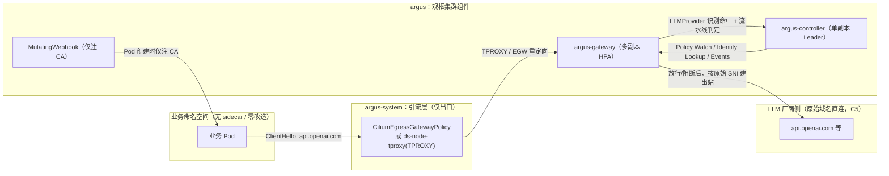

# architecture.md — Argus（观枢）逻辑拓扑 & 报文流转

## 1. 目标与边界（先把"没做的"摆出来）

MVP 阶段一（§14）**明确不做**的事这里先列出来，免得设计文档给人错觉：
- 不支持多家厂商适配，只做 OpenAI 兼容协议的出向。
- 语义检测器只预留接口，不接外部模型。
- 不做可视化面板。
- 事件只落本地 PV，不接对象存储 / SIEM。
- 不做多集群联邦。

## 2. 组件职责矩阵（对齐 spec §4）

| 角色 | 运行位置 | 必须做什么 | 绝对不许做什么 |
|---|---|---|---|
| argus-controller | Deployment, 单副本 leader election | ① watch CRD（ASP / LLMProvider）并通过 PolicyService gRPC 推全量+增量；② 提供 PodIdentityService.Lookup；③ 接收 EventService.ReportEvents 流式写入本地 PV；④ 双向健康检查。 | **不许跑任何检测业务逻辑**；不许拿 cluster-admin。 |
| argus-gateway | Deployment 多副本 + HPA + Service | ① 接收透明出口流量（TLS/HTTP1/HTTP2）；② SNI 命中 LLMProvider 才进检测流水线，否则原样透传；③ 流水线 rules → heuristic → encoding → (semantic reserved)；④ 风险打分 + 策略引擎（monitor/enforce × fail-open/closed）；⑤ 填 AIEvent 20+ 字段后异步 gRPC 上报。 | **不许申请任何 k8s RBAC 权限**；身份全走 controller；不许 InsecureSkipVerify=true。 |
| 引流层（Cilium eBPF 或 iptables TPROXY） | argus-system 命名空间，不在业务命名空间放任何 sidecar/DaemonSet sensor | 把匹配 LLMProvider.hosts 的出向 443 流量透明重定向到 gateway Service | 不做协议解析；故障时按引流层各自文档走"透传直通 + 告警"，不静默丢包。 |
| MutatingWebhook（CA 注入） | argus-system 命名空间 | 仅做两件事：① 为白名单内 Pod 注入 argus CA 到 trust store；② 设环境变量如 SSL_CERT_FILE。 | 不 sidecar、不改 SDK、不篡改 OPENAI_BASE_URL。 |

## 3. 逻辑拓扑图（Mermaid）

## 4. 一条请求完整流转（13 步，含失败分支）

1. 业务 Pod 业务代码直接调用 `openai.chat.completions.create()`，Host=`api.openai.com`。
   * （C3 要求：源码 / Dockerfile / SDK 零修改；没设 OPENAI_BASE_URL。）
2. 容器内程序发起 `TCP connect(api.openai.com:443)`，DNS 解析仍返回真实 LLM 厂商 IP（C5）。
3. 集群出口引流层（Cilium EGW / iptables TPROXY）匹配到 `LLMProvider.hosts`，把报文透明送到 argus-gateway Service。
4. gateway 从 ClientHello 拿 SNI，走 PolicyService gRPC 快照问：这是谁？策略是什么？
   * controller 没回话 / 快照过期：按 `failureMode` 走降级（fail-open 直通 vs fail-closed 阻断），同时记事件 `failure_reason=controller_unreachable`。
5. SNI 命中但 `LLMProvider.skipTLSInspection=true`：走 A 模式（被动观测），只记元数据，不解密、不进检测，直通。
6. SNI 命中且 `tlsInspection.enabled=true`（B 模式默认）：gateway 读 k8s Secret `argus-ca-tls`，
   按 SNI 动态签一张叶子证书，把 TLS 终止在网关里。
   * 秘钥读不到：按 `failureMode` 降级（见 tls-design.md 故障降级表）。
   * 业务 Pod 里因为 Webhook 已经把 CA 根放进 trust store，握手成功。
7. 应用层协议识别：HTTP/1.1 h1 / h2（h2 ALPN 已谈判就走 h2）。
8. Provider adapter（仅 OpenAI 兼容）识别路径 `/v1/chat/completions` / `/v1/completions`，
   把单轮 / 多轮 / 带 tools 的 prompt 抽成 `proto:LLMRequest`。
   * 非 LLM 路径（比如同一个 SNI 下别的 API）：不在此列，不进检测流水线，直连。
9. 检测流水线按序：rules → heuristic → encoding。
   * 任一阶段超时/报错：按 §12.3 矩阵走。
10. 把 3 个检测器的结果合成最终 `risk_score ∈ [0,1]`。
11. 策略引擎读 `ASP.mode` × `ASP.failureMode`：
    * `monitor` → 一律放行，仅记日志 + 事件。
    * `enforce` → `risk_score > thresholds.blockScore` 就阻断（HTTP 451/GRPC 状态）。
12. gateway 组装 `AIEvent`（含 cluster_id/session_id/request_id，`request_payload` 默认截断 4KiB + 脱敏），
    异步调 `EventService.ReportEvents(stream)` 上报 controller；controller 按 `cluster_id/date/event_id.jsonl` 落盘。
13. gateway 放行路径：用和业务原目的 IP/SNI 一致的出站连接去 `api.openai.com`，SSE/body 原样反压回业务客户端；阻断路径：直接回 451，且上报 `final_action=BLOCK`。

## 5. 数据一致性 & 故障语义

- 事件语义"至少一次"：ReportAck 带 `retry_delay_ms`，失败重试窗口 `[window_start_ms, window_end_ms]`（见 event.proto）。
- controller 重启后 PolicyService 必须推全量快照，gateway 拿到新快照前用旧快照 + 自己的 `failureMode`。
- 任何"安全层自身挂了"的情况默认行为由 **Pod 级 ASP.failureMode 控制**，不是由全局 env 决定。
