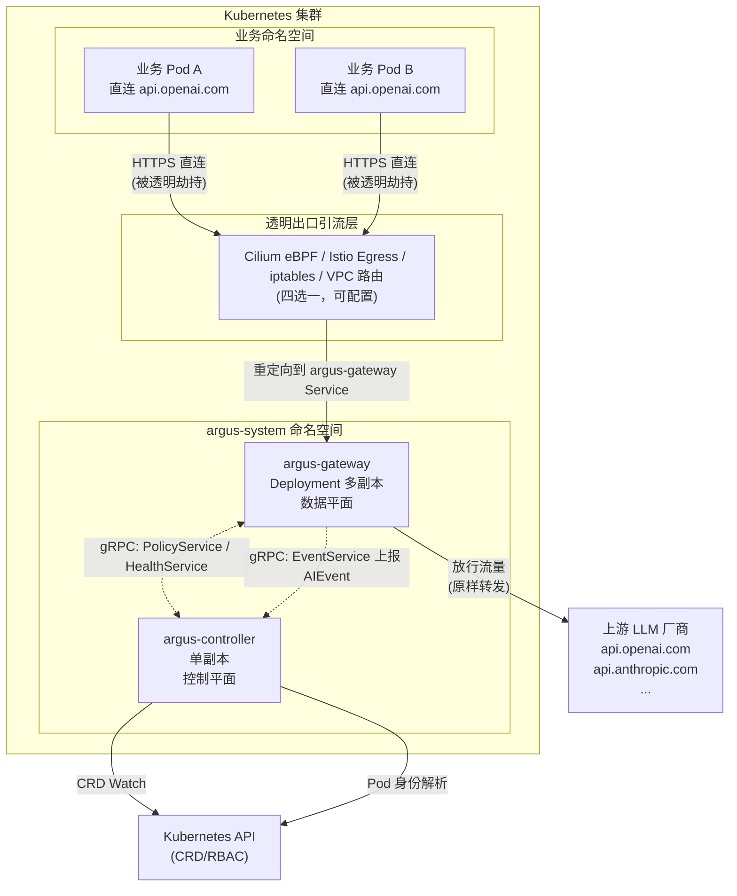
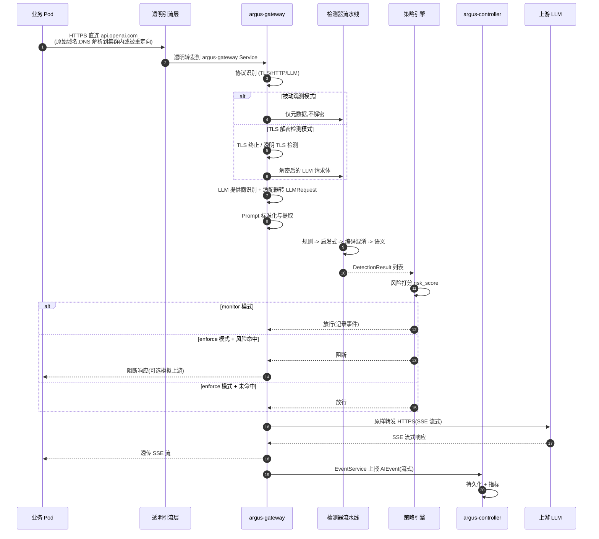
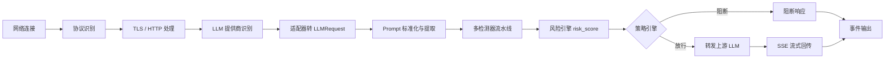

# Argus（观枢）架构设计

> 文档说明：本文档对应 `spec.md` §3 / §4 / §5 / §6 / §7，描述 Argus 系统的逻辑拓扑、组件职责矩阵、数据平面与控制平面的职责边界，以及内部 gRPC 服务契约概要。本文档为 MVP 阶段一设计基线，任何后续实现不得违背 §2 中的硬性架构约束。

## 1. 概述

Argus 是 Kubernetes 原生的 AI 大模型出口安全网关。其核心思想是：在业务 Pod 不做任何改造的前提下，通过集群全局透明出口引流将业务 Pod 直连 LLM 厂商的 HTTPS 流量重定向到 `argus-gateway`，由网关完成协议识别、Prompt 提取、多检测器流水线、风险打分与放行/阻断决策，并产出标准化 `AIEvent` 安全事件。

系统遵循以下五条不可妥协的硬性架构约束：

| 编号 | 约束 | 说明 |
| --- | --- | --- |
| C1 | 单集群单逻辑网关 | 每个 K8s 集群部署单个逻辑集群级别的观枢安全网关（Deployment 多副本逻辑统一）。 |
| C2 | 禁止 Sidecar / DaemonSet | 禁止 Pod 侧车模式、禁止每容器 Agent、禁止节点级 DaemonSet 传感器。 |
| C3 | 业务零改造 | 不改业务源码 / Dockerfile / LLM SDK，不要求配置 `OPENAI_BASE_URL` 等环境变量。 |
| C4 | 全局透明出口引流 | 流量靠集群全局透明出口网络能力引流，不依赖业务侧配置代理。 |
| C5 | 原始域名直达 | Pod 仍直接请求 LLM 厂商原始域名，业务感知不到网关存在。 |

> 关于四方案对比与选型，详见 [traffic-interception.md](./traffic-interception.md)；关于 TLS 解密检测，详见 [tls-design.md](./tls-design.md)。

## 2. 逻辑拓扑

下图展示 Argus 在单 Kubernetes 集群中的逻辑拓扑：业务命名空间中的 Pod 直连 LLM 厂商域名，由透明出口引流层（Cilium eBPF / Istio Egress / iptables / VPC 路由，四选一）将匹配流量重定向到 `argus-gateway`，网关再决定放行转发到上游 LLM 还是阻断响应。控制平面 `argus-controller` 负责策略下发、Pod 身份解析与 `AIEvent` 持久化。



拓扑要点：

- 业务 Pod 与 `argus-gateway` 之间没有显式调用关系，连接由引流层透明建立。
- `argus-gateway` 与 `argus-controller` 之间通过 gRPC 双向通信：策略下发（controller → gateway）、事件上报（gateway → controller）、心跳健康（双向）。
- `argus-controller` 是唯一与 Kubernetes API 直接交互的组件，所有需要 RBAC 的操作（CRD watch、Pod 元数据查询）集中在控制器中，网关无 K8s API 权限。

## 3. 完整报文请求流转路径

下图展示一次完整 LLM 请求的报文流转：从业务 Pod 发起 HTTPS 直连开始，到 `AIEvent` 上报并持久化为止。流程中包含被动观测与 TLS 解密两种模式分支，以及 monitor / enforce 两种运行模式的放行/阻断决策。



流转关键点：

1. **业务无感知**：业务 Pod 始终认为自己在直连 `api.openai.com`，TLS 握手 SNI、Host 头均保持原始值。
2. **协议识别优先**：网关先识别协议类型，仅 LLM 流量进入深度检测流水线，非 LLM 流量透传以最小化开销。
3. **检测与策略分离**：检测器流水线只负责输出 `DetectionResult` 与 `risk_score`，是否阻断由策略引擎根据运行模式决定。
4. **流式透传**：上游响应以 SSE 流式回写，网关按 chunk 透传，禁止在内存中聚合完整响应（有界内存约束）。
5. **事件闭环**：每次请求处理完成后必产 `AIEvent`，包括放行、阻断、降级三类。

## 4. 组件职责矩阵

Argus 仅由两个组件构成：数据平面 `argus-gateway` 与控制平面 `argus-controller`。下表清晰划分两者的职责边界，任何职责错位（例如在控制器中跑检测、在网关中查 K8s API）都视为架构违规。

| 能力 / 职责 | argus-gateway | argus-controller | 备注 |
| --- | :---: | :---: | --- |
| 接收被劫持的出口流量 | 是 | 否 | 仅数据平面 |
| TLS 终止 / 透明 TLS 检测 | 是 | 否 | 见 [tls-design.md](./tls-design.md) |
| LLM 协议识别与适配器 | 是 | 否 | OpenAI 兼容优先 |
| Prompt 提取与标准化 | 是 | 否 |  |
| 多检测器流水线 | 是 | 否 | MVP 用 Go，留接口供 C++ 替换 |
| 风险打分与策略决策 | 是 | 否 |  |
| SSE 流式代理 + 背压 | 是 | 否 | 有界内存 |
| 上报 AIEvent | 是（生产者） | 是（消费者） | EventService 流式 |
| CRD 管理（ArgusSecurityPolicy / LLMProvider） | 否 | 是 |  |
| 策略 / Provider 配置下发 | 否 | 是 | PolicyService |
| Pod 身份解析（RBAC） | 否 | 是 | 见 [pod-identity.md](./pod-identity.md) |
| 健康状态采集 | 是（上报） | 是（聚合） | HealthService |
| 持久化安全事件 | 否 | 是 | MVP 阶段先用本地存储 |
| Prometheus 指标暴露 | 是 | 是 |  |
| 繁重检测业务逻辑 | 否 | 否 | 控制平面严禁运行检测 |

职责分离的核心原则：

- **数据平面无 K8s 权限**：网关 Pod 的 RBAC 应为空，所有需要 RBAC 的能力（CRD watch、Pod 元数据查询）由控制器代为执行。这样即便网关被攻破，也无法横向移动到 K8s 控制面。
- **控制平面不做繁重计算**：检测器流水线、风险打分等 CPU 密集型逻辑全部在网关侧执行，控制器仅做配置下发与事件持久化，避免控制器单点 CPU 瓶颈。
- **gRPC 解耦**：两个组件之间所有交互都通过 gRPC 完成，便于后续水平扩容与拆分。

## 5. 数据平面 argus-gateway

### 5.1 部署形态

`argus-gateway` 以 `Deployment` 多副本形式部署在 `argus-system` 命名空间，前端挂载 `Service`（ClusterIP），可选 NodePort/LoadBalancer 用于指标暴露。多副本逻辑统一对外表现为"单个集群级网关"，符合 C1 约束。

| 部署属性 | 值 |
| --- | --- |
| 工作负载类型 | Deployment |
| 默认副本数 | 2（可通过 HPA 扩缩容） |
| 服务暴露 | ClusterIP（仅集群内引流层访问） |
| 指标暴露 | Service monitor / NodePort 9102 |
| 资源 requests/limits | 必须显式声明 |
| 水平扩容 | HPA（CPU + 自定义指标 `argus_active_llm_connections`） |
| 集群权限 | 无（不直接访问 K8s API） |

### 5.2 内部处理流水线



各阶段职责：

| 阶段 | 职责 | 关键点 |
| --- | --- | --- |
| 网络连接 | 接收透明引流流量 | 区分 LLM 流量 vs 非 LLM 流量；非 LLM 流量透传或按策略丢弃 |
| 协议识别 | 判定 TLS / HTTP/1.1 / HTTP/2 | 仅对识别出的 LLM 流量做深度检测（C5 + 性能约束） |
| TLS / HTTP 处理 | 被动观测 or TLS 解密 | 见 [tls-design.md](./tls-design.md) |
| LLM 提供商识别 | 按 SNI / Host / Path 命中 LLMProvider | OpenAI 兼容接口优先 |
| 适配器 | 转内部统一 `LLMRequest` | 多厂商差异屏蔽 |
| Prompt 标准化 | 提取 `messages` / `system` / `tools` | 处理多轮、多模态文本部分 |
| 多检测器流水线 | 规则 -> 启发式 -> 编码混淆 -> 语义 | 见 spec §13 |
| 风险引擎 | 输出 `risk_score ∈ [0,1]` | 加权聚合 |
| 策略引擎 | monitor 放行 / enforce 放行或阻断 | 见 [runmodes-failure.md](./runmodes-failure.md) |
| SSE 流式代理 | 透传上游 SSE，按 token 流式回写 | 禁止完整缓存报文 |
| 事件输出 | 产出 `AIEvent` 上报 controller | 见 spec §14 |

### 5.3 SSE 流式与背压

上游响应以 `Transfer-Encoding: chunked` 或 SSE `text/event-stream` 形式回流时，网关按 chunk 透传给业务 Pod，**禁止在内存中聚合完整响应**。上下游三段链路均启用背压：

- 当 Pod 读取慢时，网关暂停从上游读取并释放缓冲。
- 当上游推送过快时，对上游施加 TCP 层反压。
- 单连接缓冲上限可配置（默认 64KiB），超出后触发背压而非 OOM。
- 流式期间持续刷新检测器上下文，必要时对增量 token 做轻量检测（语义检测器仅在请求阶段执行，响应阶段不重复跑全量语义检测）。

### 5.4 有界内存与水平扩容

| 维度 | 约束 | 实现 |
| --- | --- | --- |
| 单连接内存 | 有界 | 流式缓冲上限 + 背压 |
| 单 Pod 连接数 | 有界 | `max_connections` 配置 + LRU 关闭 |
| Pod 水平扩容 | 支持 | HPA（CPU + 自定义指标 `argus_active_llm_connections`） |
| CPU 瓶颈规避 | 是 | 检测器流水线可在后续替换 C++ 实现（接口预留） |
| 非检测路径开销 | 最小 | 仅 LLM 流量进入深度检测流水线 |

### 5.5 Prometheus 指标

| 指标名 | 类型 | 说明 |
| --- | --- | --- |
| `argus_request_total{provider,model,action}` | Counter | 入站 LLM 请求计数，按 action=allow/block |
| `argus_request_duration_seconds` | Histogram | 端到端延迟 |
| `argus_detection_duration_seconds{detector}` | Histogram | 单检测器耗时 |
| `argus_detection_hits_total{detector,type}` | Counter | 检测器命中计数 |
| `argus_active_llm_connections` | Gauge | 当前活跃 LLM 连接 |
| `argus_blocked_total{policy}` | Counter | 阻断计数 |
| `argus_sse_streams_total` | Counter | SSE 流计数 |
| `argus_event_report_failures_total` | Counter | 事件上报失败计数 |
| `argus_gateway_health` | Gauge | 网关健康（1/0） |

## 6. 控制平面 argus-controller

`argus-controller` 以 `Deployment` 单副本形式部署（启用 leader election，预留 HA 切换），纯 Go 实现。控制器是系统中唯一持有 K8s RBAC 权限的组件，所有需要权限的操作集中于此。

### 6.1 核心职责

| 职责 | 实现方式 |
| --- | --- |
| CRD Watch | 通过 `controller-runtime` 监听 `ArgusSecurityPolicy`、`LLMProvider`，缓存后通过 gRPC 下发到所有 gateway 副本 |
| 策略下发 | `PolicyService.WatchPolicies` / `WatchProviders` 推送全量 + 增量快照 |
| Pod 身份解析 | 维护 PodIP → Pod 元数据缓存（watch 全集群 Pod），通过 `PodIdentityService.Lookup` 响应网关查询 |
| 事件接收与持久化 | `EventService.ReportEvents` 流式接收 `AIEvent`，MVP 写入本地 PV |
| 健康聚合 | `HealthService.ControllerHealth` + 接收 `GatewayHeartbeat` |
| MutatingWebhook | Pod CREATE 时注入 CA 证书（见 [tls-design.md](./tls-design.md)） |

### 6.2 严禁事项

- **严禁在控制器中运行繁重检测业务逻辑**：检测器流水线、风险打分等 CPU 密集型计算属于数据平面职责。控制器单副本，若承载检测会导致单点瓶颈与延迟尖刺。
- **严禁在控制器中持久化业务请求体明文**：`AIEvent` 中 `request_payload` / `response_payload` 默认截断到 4KiB，敏感字段需脱敏。
- **严禁控制器直接访问业务 Pod 网络**：所有跨命名空间通信必须通过 Service + RBAC 显式声明。

### 6.3 持久化策略

MVP 阶段使用本地 PV 持久化 `AIEvent`，按 `cluster_id/date/event_id.jsonl` 滚动文件，单文件 100MB 滚动。后续迭代接入对象存储 / 外部 SIEM。

## 7. 内部 gRPC 服务契约

Argus 优先编写 protobuf 契约再写业务代码。以下为契约概要，正式 `.proto` 文件在脚手架阶段产出。所有服务均通过 gRPC over mTLS 通信（mTLS 证书由 controller 签发）。

### 7.1 PolicyService（controller → gateway 下发）

`PolicyService` 用于 controller 向 gateway 推送策略与 Provider 配置。gateway 发起 watch，controller 维护 watch 流并推送全量 + 增量快照。

| 方法 | 语义 |
| --- | --- |
| `WatchPolicies(stream WatchRequest) returns (stream PolicySnapshot)` | gateway 发起 watch，controller 推送全量 + 增量策略快照 |
| `WatchProviders(stream WatchRequest) returns (stream ProviderSnapshot)` | 同上，推送 LLMProvider 配置 |

设计要点：

- 全量快照在 watch 建立时立即下发一次，确保新启动的 gateway 副本能立即拿到当前策略。
- 增量快照基于资源版本号（resourceVersion）做 diff，避免重复传输。
- watch 流断开后 gateway 退避重连，重连时重新请求全量快照。

### 7.2 DetectionService（gateway 内部检测器抽象）

`DetectionService` 是检测器流水线的统一抽象，既支持进程内 in-process gRPC（MVP Go 检测器），也支持后续替换为远程 C++ 检测器，对代理层透明。

```protobuf
service DetectionService {
  rpc Detect(DetectRequest) returns (DetectResponse);
  rpc DetectStream(stream DetectRequest) returns (stream DetectResponse);
}

message DetectRequest {
  LLMRequest request = 1;
  DetectionContext context = 2;  // 多轮会话上下文
}
message DetectResponse {
  repeated DetectionResult results = 1;
  double risk_score = 2;
}
```

设计要点：

- `Detect` 用于单次请求检测，`DetectStream` 用于多轮会话增量检测。
- `DetectionContext` 携带会话历史，便于跨轮累积攻击识别。
- MVP 阶段检测器以 in-process gRPC 形式运行，与 gateway 同进程；后续可无缝切换为远程 C++ 实现。

### 7.3 EventService（gateway → controller 上报）

`EventService` 用于 gateway 向 controller 流式上报 `AIEvent`。

| 方法 | 语义 |
| --- | --- |
| `ReportEvents(stream AIEvent) returns (ReportAck)` | gateway 流式上报，controller 批量 ack |

设计要点：

- gateway 维护一个长流，所有 `AIEvent` 通过该流批量发送，降低单事件 RPC 开销。
- 流断开后 gateway 退避重连，重连前事件本地落盘兜底，重连成功后补传。
- `ReportAck` 包含批量 ack ID 与失败原因，便于精准重试。

### 7.4 HealthService（双向健康检查）

`HealthService` 用于 gateway 与 controller 之间的双向健康检查。

| 方法 | 语义 |
| --- | --- |
| `GatewayHeartbeat(stream Heartbeat) returns (HeartbeatAck)` | gateway → controller 心跳 |
| `ControllerHealth(Empty) returns (HealthStatus)` | gateway 探测 controller 健康 |

设计要点：

- gateway 每 10s 上报心跳，包含当前活跃连接数、QPS、检测器延迟等指标。
- controller 通过心跳感知 gateway 副本存活，配合 leader election 实现 HA 感知。
- gateway 启动时主动探测 `ControllerHealth`，若 controller 不可达则按 `failureMode` 处理（见 [runmodes-failure.md](./runmodes-failure.md)）。

## 8. CRD 资源模型

Argus 通过两个 CRD 暴露用户配置接口：

- `ArgusSecurityPolicy`：定义运行模式、故障模式、检测器开关、阈值、作用域。
- `LLMProvider`：定义 LLM 厂商域名、SNI、上游转发、适配器类型、模型列表、是否跳过 TLS 检测。

完整 CRD 定义见 spec §8，部署示例见 [helm-install.md](./helm-install.md)。

## 9. 部署形态总览

```
argus-system 命名空间
├── Deployment/argus-gateway        (多副本, HPA)
├── Service/argus-gateway           (ClusterIP, 引流层访问入口)
├── Deployment/argus-controller     (单副本, leader election)
├── Service/argus-controller        (ClusterIP, gRPC)
├── Secret/argus-ca-tls             (CA 根证书)
├── Secret/argus-leaf-tls           (网关叶子证书)
├── ConfigMap/argus-config          (运行模式、阈值)
├── NetworkPolicy/argus-gateway-egress  (限制出口至 LLMProvider.hosts)
├── MutatingWebhook/argus-ca-inject (向业务 Pod 注入 CA)
├── DaemonSet/argus-node-tproxy     (仅 iptables 兜底方案, 节点级引流)
└── CiliumEgressGatewayPolicy/argus (仅 Cilium 方案)
```

> 注：`DaemonSet/argus-node-tproxy` 是节点级引流组件，运行在 `argus-system` 命名空间，仅做透明流量重定向，**不是业务 Pod 的 sidecar / sensor**，符合 C2。

## 10. 相关文档

- [流量引流方案对比](./traffic-interception.md)
- [Pod 身份溯源设计](./pod-identity.md)
- [TLS 解密检测设计](./tls-design.md)
- [运行模式与故障场景](./runmodes-failure.md)
- [Helm 安装指南](./helm-install.md)
- [端到端验证](./e2e-verification.md)
