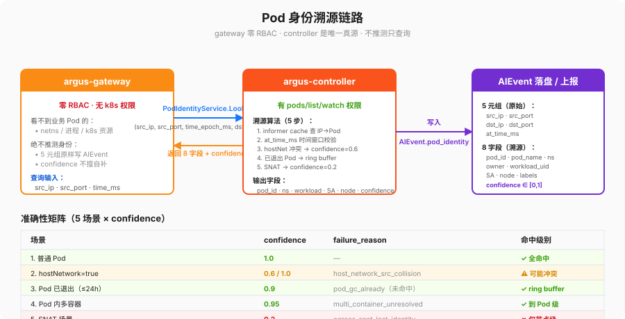
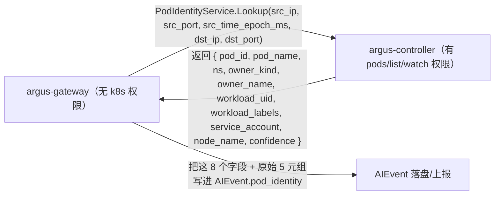

# pod-identity.md — 身份溯源链路 & 准确性矩阵

## 1. 目标

gateway 里 **看不到** 业务 Pod 的 netns / 进程 / k8s 资源（checklist C2、§7 gateway Pod 零 RBAC）。
所以溯源链路必须是：

语义：**gateway 自己绝不推测身份**；controller 是唯一真源。controller 返回 `confidence < 1.0` 时，
gateway 必须原样把 `confidence` 填进事件，不能擅自补。

## 2. controller 侧溯源算法（步骤写清楚，将来 reviewer 对代码）

给定 `{src_ip, src_port, at_time_ms}`：
1. 拿 `IP -> pod` 先从 informer cache 查：
   - `pod.status.podIP == src_ip`：候选候选 1（普通 Pod 正常路径）。
   - `pod.status.hostIP == src_ip and pod.spec.hostNetwork=true`：候选 2（hostNetwork 路径）。
2. 如果候选唯一，再用 `at_time_ms ∈ [pod.status.startTime, pod.status.phase==Running?∞:now or deletionTimestamp]` 做时间窗口校验。
3. 如果候选 1 不唯一（hostPort / 同一个 node 上多个 hostNet pod 同时用 src_port 冲突这种极端情况），再看 node 上的 conntrack 来源？
   **不，controller 不读节点 conntrack（MVP 阶段一就别碰节点特权）**；这种场景直接返回 `confidence=0.6`，并在 `failure_reason` 写 `host_network_src_collision`，让审计阶段人工看。
4. 对"已经退出的 Pod"（informer cache 已经不持有）：controller 自己维护一个 24h ring buffer（内存里），
   key=pod_id + deletion_timestamp；如果 buffer 里也找不到，返回 `confidence=0.1` + `failure_reason=pod_gc_already`，告诉下游"我找不到了，这事件只能定位到 node 级"。
5. SNAT 场景（src_ip 不是 podIP，而是 node SNAT 后的）：返回 `confidence=0.2`，只能定位到节点，不能定位到具体 Pod；
   文档里**显式写明**：SNAT 是身份溯源天然弱点，要么关出向 SNAT，要么加节点级溯源 agent（MVP 阶段一不做）。

## 3. 准确性矩阵（5 场景 × 维度）

每一行对应 checklist §3 `docs/pod-identity.md` 要求的"准确性矩阵"。

| 场景 | pod_id 命中 | namespace 命中 | workload 命中 | serviceAccount 命中 | confidence | failure_reason 可能值 |
|---|---|---|---|---|---|---|
| 1. 普通 Pod（非 hostNet，非 SNAT，未退出） | ✅ | ✅ | ✅ | ✅ | 1.0 | 空 |
| 2. hostNetwork=true 的业务 Pod（出向用 hostIP） | ⚠️ 依赖 cache 中同一节点唯一候选 | ✅ | ⚠️ hostPort 冲突时不准 | ✅ | 0.6（冲突时）/1.0（唯一时） | host_network_src_collision |
| 3. Pod 已退出（informer 已清，≤24h） | ✅（ring buffer） | ✅ | ✅ | ✅（buffer 留） | 0.9 | 空（命中） / pod_gc_already |
| 4. Pod 内多容器（init / sidecar / app 多个进程） | ✅（只能定位到 Pod） | ✅ | ✅ | ✅ | 0.95 | `multi_container_unresolved_container`（仅 MVP 阶段一不精确到容器级时写） |
| 5. 出向 SNAT 场景（src_ip = node IP 而非 podIP） | ❌ | ❌ | ❌ | ❌ | 0.2 | egress_snat_lost_identity |

## 4. 两种降级不犯错

- 溯源拿不到身份时：**按 `failureMode` 继续放行/阻断，别把 HTTP 请求挂死**，只把事件 `confidence` 如实写下来。
- 业务在升级 / Pod 在 rolling（create/delete 抖动）：用 `at_time_ms` 时间窗口做一次重试（最多 2 次 lookup RPC），不要一上来就报 `pod_gc_already`。
