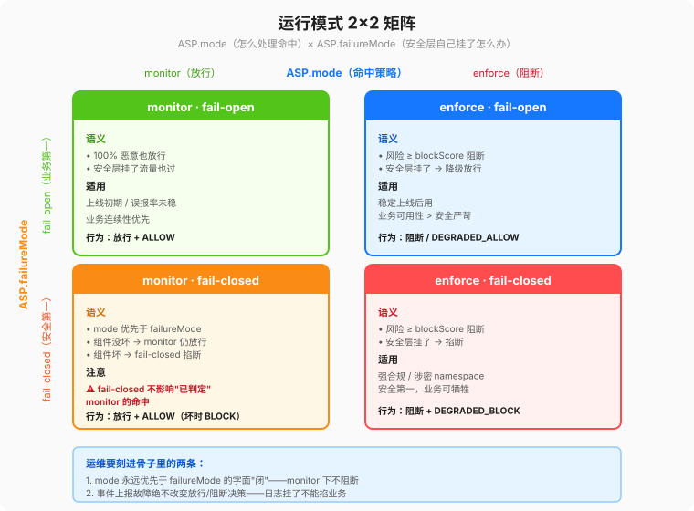

# runmodes-failure.md — monitor / enforce × fail-open / fail-closed + §12.3 24 格矩阵

## 1. 基本语义（别混，错了会让业务/安全两边都骂）

| 维度 | 值 | 语义 |
|---|---|---|
| `ASP.mode`（怎么处理命中） | `monitor` | 就算判定为 100% 恶意，也**放行**，只在事件 + 日志里打高风险。给上线初期、误报率还不稳定时用。 |
| | `enforce` | 风险分 ≥ `thresholds.blockScore` 就**真阻断**，回业务 HTTP 451 + `argus-final-action: block`。给稳定上线后用。 |
| `ASP.failureMode`（安全组件自己挂了怎么办） | `fail-open` | 安全层不可用时，默认让业务流量**过**。业务第一。 |
| | `fail-closed` | 安全层不可用时，默认把流量**掐掉**。安全第一，适合强合规/涉密 namespace。 |

## 2. 24 格矩阵（§12.3 全部格子；8 故障 × 3 组件 × mode/failureMode 2×2 压缩成下表）

说明：
- 行：故障场景（8 个）
- 列按 `(mode, failureMode)` 分 4 格：(monitor,open) / (monitor,closed) / (enforce,open) / (enforce,closed)
- 单元格写：`最终放行/阻断决策 + AIEvent.final_action + AIEvent.failure_reason`
- 所有格：**必须生成 AIEvent**（除非写了 "No, why…"，这里 MVP 阶段一全是 Yes）。

| # | 故障场景 | (monitor, fail-open) | (monitor, fail-closed) | (enforce, fail-open) | (enforce, fail-closed) |
|---|---|---|---|---|---|
| 1 | argus-controller gRPC 断连（Policy 快照过期） | 放行 + ALLOW + controller_unreachable | 放行 + ALLOW + controller_unreachable（mode=monitor 优先级更高，fail-closed 不生效，因为没做判定） | 放行 + DEGRADED_ALLOW + controller_unreachable | 阻断 + DEGRADED_BLOCK + controller_unreachable |
| 2 | argus-controller 身份 Lookup RPC 超时 2s | 放行 + ALLOW + identity_timeout（AIEvent.pod_identity.confidence=0.1） | 同上 | 放行 + DEGRADED_ALLOW + identity_timeout | 阻断 + DEGRADED_BLOCK + identity_timeout |
| 3 | 单个检测器（rules/heuristic/encoding）超时 | 放行 + ALLOW + detector_timeout（risk_score 用其他检测器综合） | 同上 | 放行 + DEGRADED_ALLOW + detector_timeout | 阻断 + DEGRADED_BLOCK + detector_timeout |
| 4 | 整个检测流水线 pipeline_timeout=2s 全超时 | 放行 + ALLOW + pipeline_timeout | 同上 | 放行 + DEGRADED_ALLOW + pipeline_timeout | 阻断 + DEGRADED_BLOCK + pipeline_timeout |
| 5 | 读 CA Secret 失败（tls-design §5 故障） | 放行 + ALLOW + ca_secret_missing（降级 A 模式） | 阻断 + DEGRADED_BLOCK + ca_secret_missing | 放行 + DEGRADED_ALLOW + ca_secret_missing（降级 A 模式） | 阻断 + DEGRADED_BLOCK + ca_secret_missing |
| 6 | 单 SNI 叶子证书签发失败（tls-design §5 故障） | 放行 + ALLOW + leaf_cert_sign_failure（降级 A 模式，只影响该 SNI） | 阻断 + DEGRADED_BLOCK + leaf_cert_sign_failure | 放行 + DEGRADED_ALLOW + leaf_cert_sign_failure | 阻断 + DEGRADED_BLOCK + leaf_cert_sign_failure |
| 7 | 事件上报 EventService.ReportEvents 连续 3 次 ack 失败（不影响业务路径） | 放行 + ALLOW + event_sink_degraded（内存缓冲到上限后丢事件，打 WARN） | 同上 | 放行 + ALLOW/按风险分正常 BLOCK + event_sink_degraded | 放行 + ALLOW/按风险分正常 BLOCK + event_sink_degraded（⚠️ 事件失败不应该改变放行/阻断决策，不然会出现"日志挂了就把业务掐断"的傻逼事故） |
| 8 | 引流层故障（Cilium EGW CR 配错 / iptables 链崩） | **引流层自己的 fail-open 透传直通**；gateway 看不到流量，因此**没有 AIEvent**，只能靠引流层指标告警补审计缺口 | 引流层 fail-closed 掐断出口，业务全挂（不推荐，只能强合规 ns 用） | 同左（引流层的 open/closed 是 helm values 单独开关，不是 ASP.failureMode，两者层次要分清） | 同左 |

## 3. 两条"运维要刻进骨子里"的话

1. **mode 永远优先于 failureMode 的字面"闭"**：
   比如 (monitor, fail-closed) 这种组合，fail-closed 只影响"安全组件自己已经坏了、根本做不出判定"的极端情况；
   如果组件没坏，monitor 模式不管风险分多高都放行——不然就不叫 monitor，应该叫 enforce。
2. **事件上报故障绝不改变放行/阻断决策**（第 7 行的重点）：
   如果因为"日志磁盘写满"就把业务所有 LLM 出向掐断，那是反模式。
   正确做法：AIEvent 内存缓冲达到上限就丢最老的事件 + Prometheus `argus_event_dropped_total` 告警 + controller 端补批量重放恢复。
