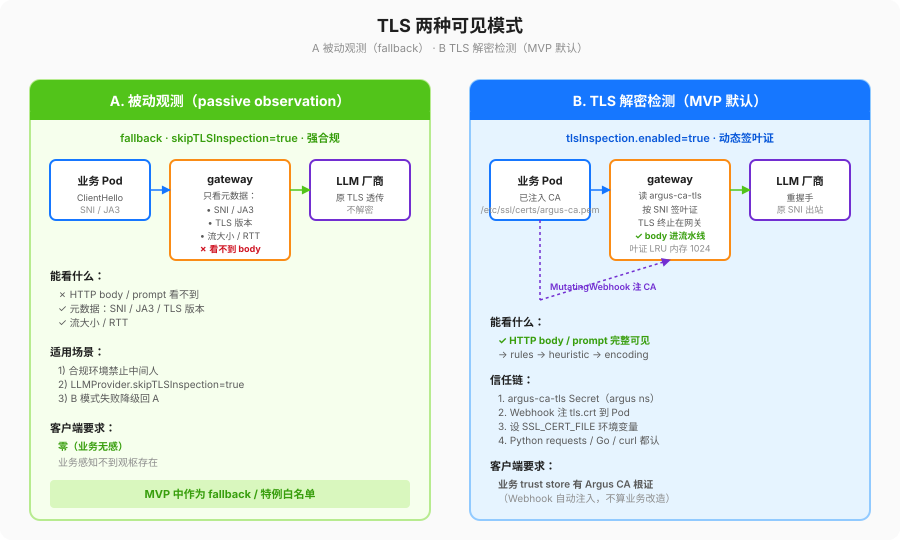

# tls-design.md — 两种可见模式 + CA 信任模型 + 证书轮换 + 风险 + 降级

## 1. 两种可见模式

| 模式 | 能否看到 HTTP body / prompt？ | 适用场景 | 对客户端的要求 |
|---|---|---|---|
| **A. 被动观测（passive observation）** | ❌。只能看到 ClientHello SNI / JA3 / 握手 TLS 版本 / 流大小 / RTT 这类元数据。 | 1) 合规环境严格禁止中间人；2) LLMProvider.skipTLSInspection=true 的特例白名单；3) B 模式失败降级回 A。 | 零：业务侧什么都不用改，业务感知不到观枢的存在。 |
| **B. TLS 解密检测（TLS-terminated inspection，MVP 默认）** | ✅。网关动态签叶子证书把 TLS 终止在自身，body 过检测流水线之后再和真实上游重握手。 | 默认，绝大多数 LLMProvider。 | 需要业务 Pod 的 trust store 里有 Argus 的 CA 根证书（通过 MutatingWebhook 自动注入，不算业务改造 C3）。 |

MVP 默认行为：**B 开启，A 作为 fallback**。

## 2. CA 根证书要求 & 信任模型

- 根证书（`argus-ca-tls` Secret）**只能有一份**，放在 `argus` 命名空间，keys = `tls.crt`, `tls.key`。
- 根证书密钥算法：RSA-2048 或 ECDSA P-256。禁止 RSA-1024、md5、sha1。
- 根证书有效期 ≤ 365 天；叶子证书 ≤ 24h。
- 根证书信任链：
  1. MutatingWebhook 在 Pod 创建时，把 `tls.crt` 注入到 Pod 内 `/etc/ssl/certs/argus-ca.pem`。
  2. 设环境变量 `SSL_CERT_FILE=/etc/ssl/certs/argus-ca.pem`（对 Python requests、Go stdlib tls、curl 都生效）。
  3. 下列**三类白名单**不解密：
     - `ASP.scope.excludeNamespaces`（如 kube-system、监控）。
     - `LLMProvider.skipTLSInspection=true`。
     - Pod annotation `argus.argus.io/inspect=skip`（审计级开关，仅限 incident 临时用）。
- 根证书**私钥**（`tls.key`）：只能在 controller 生成叶子证书时用，**绝不能挂载到业务 Pod**（webhook 只注 tls.crt）；
  绝不能以文件形式写入宿主机（只存在内存里的 tls.Config）；绝不能打进 AIEvent 日志。

## 3. 证书生成逻辑 & 轮换

| 对象 | 谁生成 | 怎么轮换 |
|---|---|---|
| 根 CA（`argus-ca-tls`） | 首次安装时 cert-manager `Issuer` / `ClusterIssuer` 生成（helm values `tlsInspection.ca.generate=true`）。 | cert-manager 到期前自动 renew。**手动轮换流程**：1) 新老两张根证书都注进业务 trust store 过一段兼容期；2) 老根到期后只留新根。 |
| 叶子证书（每个 SNI 一张，<24h） | gateway 启动时读根 Secret，遇到新 SNI 当场签，存在内存 LRU（默认 1024 条，LRU 淘汰冷的 SNI）。 | 过期前 2h 自动重签。**不持久化到 PVC**，重启重新签就行。 |

## 4. 安全风险影响表

| 风险 | 发生条件 | 对安全的影响 | Mitigation |
|---|---|---|---|
| CA 根私钥泄漏 | 有人拿到了 `argus-ca-tls` Secret 写权限 | 攻击者可以签任何域名的证书，观枢的信任根变成攻击者的 MITM 工具 | ① 最小 RBAC：只有 controller/webhook SA 能读这个 Secret；② 根私钥建议放 KMS 而不是裸 Secret（下一阶段做）；③ 轮换流程文档化。 |
| 业务 Pod 没信任 CA | webhook 没装成 / 基础镜像不认 `SSL_CERT_FILE` | B 模式下业务握手失败，表现为所有出向 LLM 请求失败 | 降级见 §5 表；同时提供"按 Pod 跳过解密"的 annotation 应急。 |
| 白名单绕过 | 有人在 ASP scope 里把整个集群包进 excludeNamespaces | 所有流量不解密，等于观枢白开了 | ① ASP CRD 做 admission webhook 校验（下一阶段）；② controller 指标 `argus_asp_excluded_namespaces_total` 设 Prometheus 告警。 |
| 用 InsecureSkipVerify 绕校验 | 图省事把上游 TLS Verify 关了 | 上游证书被换了也发现不了，等于中间人两次 | **代码里一律不允许**（§10.2 强制 + pre-commit hook grep）；有自签上游场景，显式把上游 CA 塞进 `LLMProvider.upstream.ca_bundle_ref`。 |

## 5. 故障降级行为表（共 6 条，每行可直接写测试）

| 故障 | ASP.mode | ASP.failureMode | 观枢行为 | 是否生成 AIEvent？ | event.failure_reason / severity |
|---|---|---|---|---|---|
| CA Secret 完全读不到 | monitor | fail-open | A 模式直通，只记元数据 | ✅ | `ca_secret_missing` / WARN |
| CA Secret 完全读不到 | monitor | fail-closed | 阻断（握手层失败） | ✅ | `ca_secret_missing` / ERROR |
| CA Secret 完全读不到 | enforce | fail-open | A 模式直通，记元数据 | ✅ | `ca_secret_missing` / WARN |
| CA Secret 完全读不到 | enforce | fail-closed | 阻断（握手层失败，HTTP 451 回业务） | ✅ | `ca_secret_missing` |
| 某 SNI 签叶证书失败（根证书过期 / SNI 非法字符） | 任意 | fail-open | 该次请求回 A 模式直通，其余 SNI 正常工作 | ✅ | `leaf_cert_sign_failure` |
| 某 SNI 签叶证书失败 | 任意 | fail-closed | 该次请求阻断，其余正常 | ✅ | `leaf_cert_sign_failure` |

## 6. 流量拦截范围 & 绕过规则（显式禁止的"捷径"）

- 拦截范围必须是：
  1. `LLMProvider.hosts` 命中。
  2. 且目标端口是 443（或 ASP 中显式列出来的其他 TLS 端口）。
  3. 且没有命中 §2 三类白名单。
- **显式禁止**（代码评审硬红线，pre-commit 里已经加了一条）：
  - 任何 `tls.Config.InsecureSkipVerify = true`。
  - 用 `http.Transport{ TLSClientConfig: &tls.Config{... 关了 Verify} }`。
  - 直接 `curl -k` 或 `openssl s_client` 绕校验的"调试脚本"打进镜像。
- 合规例外：如果上游真的是自签，必须走 `LLMProvider.upstream.ca_bundle_ref` 把上游 CA 单独挂进来；
  每一条都必须在 PR 里写明"这条为什么自签 + 什么时候可以切回公签"。
