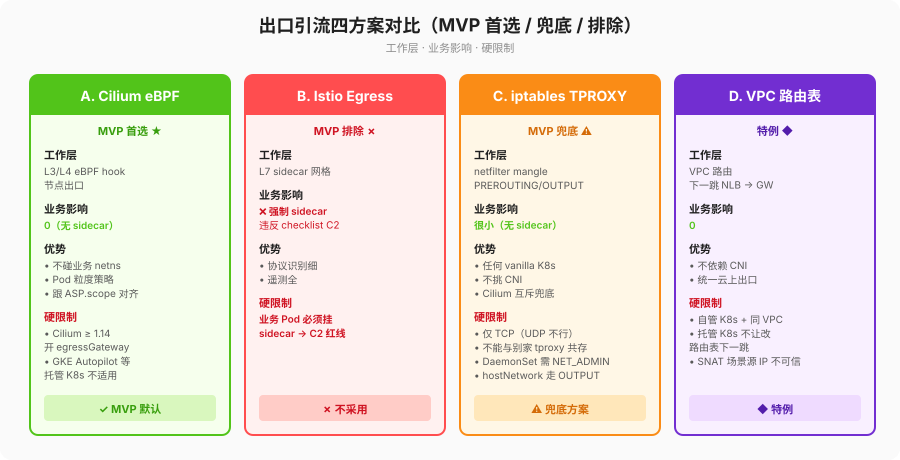

# traffic-interception.md — 透明出口引流四方案对比 & MVP 首选/兜底



## 1. 对比表（四方案各自的优势 + 硬限制，不绕弯）

| 方案 | 工作层 | 对业务影响（越小越好） | 优势 | **硬限制**（必须写进部署前检查项） |
|---|---|---|---|---|
| **A. Cilium eBPF（`CiliumEgressGatewayPolicy`）** | L3/L4 eBPF hook，节点出口 | 0（无 sidecar/agent） | 1) 不碰业务 netns；2) Pod 粒度策略，能跟 ASP.scope 对齐；3) 不需要节点级 root ns 里额外 iptables chain | 1) 必须装 Cilium ≥ 1.14 且开 `egressGateway.enabled=true`；2) 一些托管 K8s（GKE Autopilot 特定模式）不允许替换 CNI，直接不适用。 |
| **B. Istio Egress Gateway** | L7 sidecar 网格 | ❌ 业务 Pod 强制 sidecar，违反 C2 | 协议识别细，遥测全 | **MVP 阶段一直接排除**（checklist C2 明确：全集群无业务 sidecar）。 |
| **C. iptables/nftables + tproxy DaemonSet** | netfilter TPROXY（TPROXY 只能 PREROUTING/OUTPUT 的 mangle） | 很小（只在 argus-system 装一个节点级 DaemonSet `ds-node-tproxy`，**不在业务 Pod 加任何东西**） | 任何 vanilla K8s 都能用，不挑 CNI；和 Cilium 互斥时的兜底方案 | 1) 只能抓 TCP（UDP DNS 不在这里处理）；2) 同一节点已用 tproxy（mesh 出向/其他透明代理）会冲突，装之前必须 `iptables-save | grep -i tproxy` 空；3) DaemonSet 需要 `NET_ADMIN` cap。 |
| **D. VPC / 云厂商路由表（下一跳 NLB → gateway）** | VPC 路由 | 0 | 不依赖 CNI，统一云上出口 | 1) 只在**自管 K8s 且所有工作节点都在同一个可配置路由表的 VPC subnet** 才行；2) 托管 K8s node pool 往往不让你改路由表下一跳，直接排除；3) SNAT 场景源 IP 不可信，身份溯源要单独处理。 |

结论：**MVP 默认 A（Cilium eBPF），兜底 C（iptables TPROXY），B 排除，D 仅特例**。

## 2. MVP 首选：Cilium eBPF 安装步骤

前置条件（`bash deploy/examples/dev/kind-up.sh` 会自动做掉前 3 项）：
1. Cilium ≥ 1.14，helm values `egressGateway.enabled=true`。
2. 网关 Service `argus-gateway`（ClusterIP / LoadBalancer 都行，但必须有稳定 k8s service 名）。
3. 所有 `LLMProvider.hosts` 都对应到明确的 DNS 域名 / CIDR（不要用 `0.0.0.0/0` 全量引流，那会把网关打挂）。

安装：
```bash
helm install argus ./deploy/helm/argus -n argus --create-namespace \
  --set trafficInterceptor.engine=cilium
# 真实 CEGP 模板放在 deploy/helm/argus/templates/cilium/（当前阶段是 README，1-B 补 YAML）
```

局限性：
- 对非 443 的 LLM 出向（极少）需要另加 `toPorts` 规则。
- 同一 Pod 同时有允许的 LLM 域名和禁止的非 LLM 域名时，别把非 LLM 也 EGW 进 gateway。

回滚：
```bash
# 1) 先删 CEGP，让出口回到默认路径
kubectl delete ciliumegressgatewaypolicies.cilium.io -n argus -l app.kubernetes.io/name=argus
# 2) 再 helm uninstall argus（如果你确实要整个删）
helm uninstall argus -n argus
```

## 3. MVP 兜底：iptables/nftables TPROXY 安装步骤

前置条件：
1. `kubectl get nodes -o wide` 确认所有节点 OS 都有 xt_TPROXY（一般 4.18+ 都有）。
2. `iptables -t mangle -S | grep -i tproxy` 必须空；如果不是，要么换节点，要么关别家 tproxy。
3. `argus-gateway` Service 要启用 `externalTrafficPolicy=Local` 或者 podIP 可达（否则 TPROXY 回来的报文找不到原始 dst）。

安装（DaemonSet 模板在 `deploy/helm/argus/templates/iptables/`，当前只给 README，下阶段补 YAML）：
```bash
helm install argus ./deploy/helm/argus -n argus --create-namespace \
  --set trafficInterceptor.engine=iptables
```

**引流层故障降级（硬规则，别写捷径）**：`ds-node-tproxy` Pod 崩时自动：
1. 节点 prerouting/output 两个链的 return 规则跳回默认路由表，业务直连 LLM 厂商（安全降级）。
2. Prometheus 规则 `argus_tproxy_daemonset_unavailable` 触发告警（运维去查）。
3. 不静默丢包：如果 return 规则插不进去（极端情况），DaemonSet 用 `preStop` 手动清理，避免留下黑洞。

局限性：
- 只能处理 TCP 443，不是所有 L4。
- `hostNetwork=true` 的业务 Pod 走 OUTPUT 链，要和正常 Pod 的 PREROUTING 分开处理（身份溯源见 pod-identity.md 矩阵）。

回滚：
```bash
helm uninstall argus -n argus
# 再逐节点清残留（一般 DaemonSet preStop 已做，这步是保险）
# 每个节点：iptables -t mangle -D PREROUTING -j ARGUS_TPROXY ；iptables -t mangle -D OUTPUT -j ARGUS_TPROXY
```
